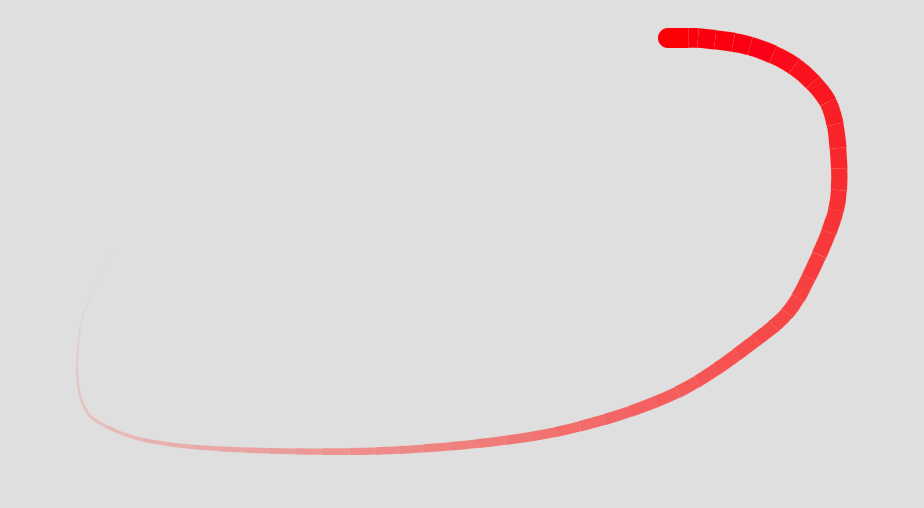
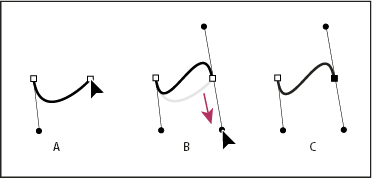
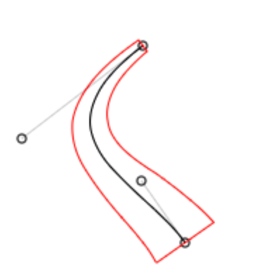
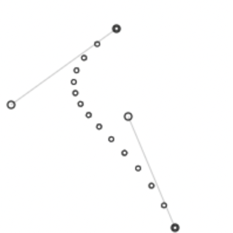

## Motivation

At one of the company’s weekly meetings, I complained that the effect of displaying the mouse track in a certain product was a bit rough:

It can be seen that its implementation is to connect the coordinates when the mousemove event is triggered with rectangles of different length and width, so there is an obvious "break" at the connection.The entire track is not smooth, and the "gradation" of its width and transparency is also relatively rigid, with obvious faults.

And my ideal mouse track should look like this:

The entire track is a smooth curve, there should be no hard "breaks" in the middle, and the width and transparency of the track change uniformly.

At that time, I felt that such a simple effect should be done a little better, and it didn't take much time.

However, at noon on a weekend, I was washing the dishes, and suddenly my mind flashed. I realized that to achieve a "perfect" mouse track effect on the web canvas seems not as simple as I imagined. So I decided to try it myself, and that was this project.

## Problems

The so-called "not as simple as I imagined" is mainly to solve these problems:

- The mouse trajectory obtained through the `mousemove` event is a discrete coordinate point, not a real trajectory curve. How to draw a smooth curve through discrete coordinates?
- The transparency of the mouse track should be gradient. The web canvas does not provide an interface for linear gradient on a path. How to achieve this effect?
- The thickness of the mouse track should also be gradual. The single path on the web canvas does not provide an interface for the gradual change of the thickness of the brush. How can this effect be achieved?

## Solution

### How to draw a smooth curve through discrete coordinates?

If you have used the pen tool in Photoshop, the answer is actually very simple, Bezier curve. The pen tool in Photoshop is actually a Bezier curve editor. You can create a curve between the start point and the end point through the start point, the end point, and two control points.

And if the two control points on an intermediate point meet certain rules, the continuity of the curve can be achieved, that is, the smoothness of the visual effect. You can read「[Draw with the Pen tools](https://helpx.adobe.com/en/photoshop/using/drawing-pen-tools.html)」if you are interested.

So what kind of law can the two control points on the intermediate point meet to achieve the continuity of the curve? The answer is very simple, that is, the middle point and the two control points are on the same straight line.

As shown below, mouse moves through points A、B、C, point B and his two control points C1 and C2 are on the same straight line, the curve is smooth at point B. Its mathematical logic is also very simple, the three points are in the same straight line, which means that the slopes of point B in the direction of C1 and C2 are the same, so that the curve is smooth.

So, how to calculate the control point of each point when the coordinates of the three points A, B, and C are known? A simple way is as shown below:

1. Calculate the angle bisector of the angle p1-pt-p2 and the perpendicular line c1-pt-c2 of the angle bisector passing through the point pt
2. Take the point c2 that is closer to pt among the projection points of p1 and p2 on c1-pt-c2
3. On c1-pt-c2, take the point c1 that is symmetrical to point c2 with respect to pt

Now using the calculated points c1 and c2 as the control points of the pt point, a smooth curve with good effect can be generated. At the same time, the distance between c1 and c2 and the pt point can also be adjusted with a tension parameter to adjustment the effect of smoothness.

### How to achieve a gradual change in width on the curve?

The `CanvasRenderingContext2D` API does not provide an interface for the width of the gradient brush when stroked the path. In other words, if you only use the two interfaces `bezierCurveTo` and `stroke`, there is no way to achieve the "perfect" mouse trajectory like the one described at the beginning of the article.

One way to solve this problem is to turn the path into a shape. To put it simply, it is to regard a wide Bezier curve as a figure surrounded by two curves and two straight lines:

When the black curve in the middle is stroked with a wide brush, the effect is actually the same as that the red area is filled. This is the so-called turning the path into a shape. In this way, we can adjust the shape of the red wire frame as needed, and we can realize a curve that looks like the width of the brush is gradual. As for how to calculate this wire frame, I will not expand it here.

### How to achieve a gradient of transparency on the curve?

Similarly, the `CanvasRenderingContext2D` API does not provide an interface for gradual brush transparency when tracing a path or filling an area. This time, you have to use the "split" method to simulate a gradual effect. In other words, if there is a curve that needs to change the pen transparency from 1 to 0, we will divide this curve into 100 curve fragments and draw them in sequence, and the transparency used when drawing these fragments will gradually change, so that The effect of transparency gradient can be achieved visually.

As shown above, we can calculate several points on a Bezier curve, use these points to divide the curve into multiple curves, and then give each curve a different transparency, so that it can be achieved visually Similar to the effect of transparency gradient.

But some of you will definitely find a problem. The distance between the dividing points in the above picture is not the same, here is another concept: Uniform Bezier curve. The formula of cubic Bezier is as follows：

So if we let the input, that is t, change at a constant speed on [0, 1], the value obtained is not at a constant speed, that is, the distance between the hollow dots in the above figure is different. However, it is very troublesome to calculate the points that divide the Bezier curve uniformly, and iterative calculation is often required to obtain an approximate value.

However, even with a simple segmentation method, as long as the number of segments is large enough, for example, divided into 50 segments, the human eye basically cannot see that the change in transparency is uneven. Therefore, it is not necessary to calculate the evenly divided points in the actual use scene.

In addition, the segmentation method can actually also solve the above problem of gradual change in width, Divide the curve into several segments, give each segment a different line width, the width of the curve seems to change evenly, and this method is actually faster than the method of calculating the curve frame mentioned above.

## Summary

Dish washing can also bring inspiration 😂
