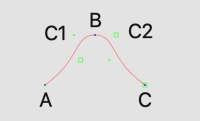

## 动机

在公司的某次周会上，我吐槽了某产品中一个显示鼠标轨迹的效果实现得比较抽象：

可以看到它的实现方式是将 `mousemove` 事件触发时的坐标，用长宽不一的矩形连接起来，所以连接处出现了明显的“断裂”，整个轨迹也不平滑，而且其宽度和透明度的“渐变”也比较生硬，有明显断层。

而我理想中的鼠标轨迹应该是长这样的：

整个轨迹是一条相对平滑的曲线，中间不应该有生硬的“断裂”，而且轨迹的宽度和透明度都均匀变化。

当时我觉得这么简单一个效果完全应该做得完善一点，也花不了多少时间。

然而，一个周末的中午，我正在洗碗，突然脑子里灵光一闪，我意识到，在 web canvas 上要实现一个「完美」的鼠标轨迹效果似乎并没有想象的那么简单。于是我决定自己尝试一下，就有了这个项目。

## 问题

所谓「并没有想象的那么简单」主要是要解决这几个问题：

- 通过 `mousemove` 事件获取的鼠标轨迹是离散的坐标点，而不是真实的轨迹曲线，如何通过离散坐标绘制平滑曲线？
- 鼠标轨迹的透明度应该是渐变的，web canvas 上并没有提供在一个 path 上做线性渐变的接口，这个效果如何实现？
- 鼠标轨迹的粗细也应该是渐变的，web canvas 上的单一 path 也没有提供画笔粗细渐变的接口，这个效果又如何实现？

## 方案

### 如何通过离散坐标绘制平滑曲线？

如果你用过 Photoshop 中的钢笔工具，答案其实就很简单，用贝塞尔曲线。Photoshop 中的钢笔工具其实就是一个贝塞尔曲线编辑器，通过起点、终点以及两个控制点，就可以在起点和终点间建立一条曲线。

而如果一个中间点上的两个控制点满足一定的规律，就可以实现曲线的连续，也就是视觉效果上的平滑。感兴趣的话可以阅读「[用钢笔工具绘图](https://helpx.adobe.com/cn/photoshop/using/drawing-pen-tools.html)」中的内容。

那么中间点上的两个控制点满足什么样的规律就可以实现曲线的连续呢？其实也很简单，就是中间点和两个控制点在同一直线上即可。

如下图，鼠标经过 A、B、C 三点，此时 B 点和他的两个控制点 C1 和 C2 在同一直线上，整个曲线在 B 点处就是平滑的。其数学逻辑也很简单，三点处于同一直线就意味着 B 点在 C1 方向和 C2 方向上的斜率都相同，这样曲线就平滑了。

那么，在已知 A、B、C 三点坐标的情况下如何计算出每个点的控制点呢？一个简单的办法如下如所示：

1. 计算角 p1-pt-p2 的角平分线，以及此角平分线经过点 pt 的垂线 c1-pt-c2
2. 取 p1、p2 在 c1-pt-c2 上的投影点中距离 pt 点较近的点 c2
3. 在 c1-pt-c2 上取与 c2 点相对 pt 对称的点 c1

此时用计算出的 c1、c2 点作为 pt 点的控制点，就能生成一个效果不错的平滑曲线了，同时 c1、c2 到 pt 点的距离还可以用一个 tension 参数进行调节，从而达到调节曲线平滑程度的作用。

### 如何在曲线上实现宽度的渐变？

首先，`CanvasRenderingContext2D` 这套 API 并没有提供描边路径时渐变笔刷宽度的接口，也就是说，如果仅仅用 `bezierCurveTo` 和 `stroke` 这两个接口是没有办法实现像文章开始时描述的那种「完美」的鼠标轨迹的。

解决这个问题的其中一个办法，就是把路径变为形状。简单来说，就是把一段有宽度的贝塞尔曲线，看做是由两条曲线和两条直线所围成的图形：

中间黑色的曲线用一个有宽度的画笔描边之后，其实和红色区域填充之后的效果是一样的，这就是所谓把路径变为形状。这样一来，我们根据需要来调整红色线框的形状，就可以实现一个看起来画笔宽度渐变的曲线了，至于如何计算这个线框这里先按下不表。

### 如何在曲线上实现透明度的渐变？

同样的，`CanvasRenderingContext2D` 这套 API 也没有提供描边路径或填充区域时渐变笔刷透明度的接口。这时就不得不使用「分割」法来模拟一个渐变效果了。也就是说，如果有一段曲线在绘制时需要将画笔透明图从 1 变为 0，我们就把这条曲线分割成 100 个曲线片段依次绘制，并且绘制这些片段时所用的透明度逐渐变化，这样就可以在视觉上实现透明度渐变的效果了。

如上图所示，我们可以在一条贝塞尔曲线上计算出若干个点，用这些点把这条曲线分割成多条曲线，然后给与每条曲线不同的透明度，这样在视觉上就可以实现类似透明度渐变的效果。

但细心的同学肯定会发现一个问题，上图中分割点之间的距离是不一样的，这里又涉及到一个概念：匀速贝塞尔曲线。三次贝塞尔曲线的公式如下：

所以如果我们让输入，也就是 t 在 [0, 1] 上匀速变化，得到的值则不是匀速的，也就是上图中空心圆点的距离是不同的。但是，要计算出均匀分割贝塞尔曲线的点非常麻烦，往往需要迭代计算才能求得一个近似值。

然而，就算用简单的分割方法，只要分割的数量够多，比如分割成 50 段，人眼也基本上看不出来透明度的变化是不均匀的，所以实际使用场景中没有必要一定要算出均匀分割的点。

另外，分割法事实上也同样可以解决上面宽度渐变的问题，把曲线分割成若干段，给与每一段不同的线宽，曲线的宽度看起来就是均匀变化的了，而且这种办法事实上比上面讲的计算曲线边框的办法速度更快。

## 总结

没事多洗洗碗。说不定就会有意外的收获 😂
